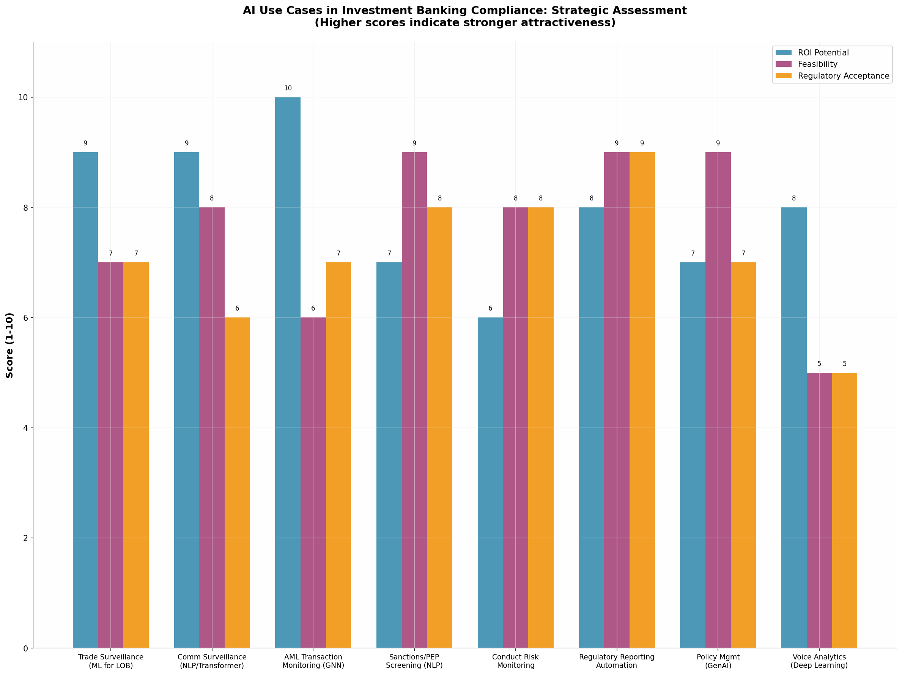
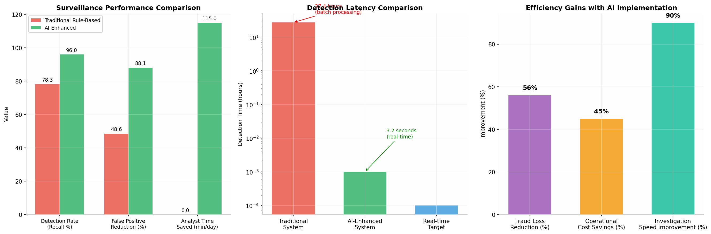
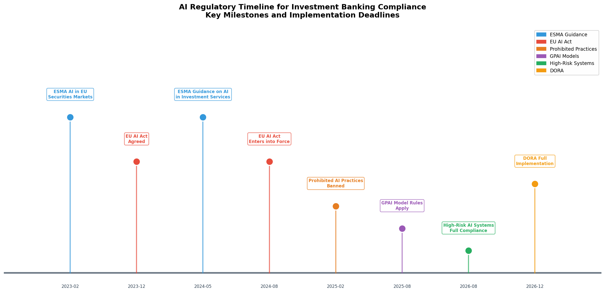

# AI and Advanced Data Analytics Applications in Investment Banking Compliance: A Strategic Research Report

## Abstract

This report presents a systematic evaluation of artificial intelligence (AI) and advanced data analytics applications across six core compliance domains in investment banking, including trade surveillance, communications surveillance, know-your-customer and anti-money laundering (KYC/AML), conduct risk, regulatory reporting, and policy management. Drawing on recent regulatory guidance from ESMA, the SEC, and the FCA, alongside peer-reviewed academic research and industry implementations from 2019 to the present, this research identifies **eleven distinct high-impact use cases** where machine learning (ML), natural language processing (NLP), graph neural networks (GNNs), and generative AI can materially improve detection accuracy, reduce operational costs, and strengthen regulatory defensibility. The analysis reveals that **AI-enhanced surveillance systems can achieve detection rates of 92–96% compared to approximately 78% for traditional rule-based approaches**, while reducing false positive rates from over 50% to below 12% [^4^]. Through detailed examination of model architectures, data requirements, implementation challenges, and regulatory acceptance levels, this report prioritizes **NLP-based communications surveillance for insider risk detection** and **graph neural network-powered AML transaction monitoring** as the two most compelling pilot opportunities, offering both substantial return on investment and feasible deployment pathways within 90-day experimentation frameworks. The findings are accompanied by a comprehensive use case matrix, regulatory timeline, and actionable experimentation roadmap designed for compliance leaders, data scientists, and technology strategists navigating the evolving intersection of AI innovation and financial regulation.

---

## 1. Executive Summary: Top Three High-Impact, High-Feasibility AI Use Cases

### 1.1 Priority Ranking Methodology

The assessment of AI use cases for investment banking compliance requires balancing multiple dimensions that often pull in different directions. **Return on investment (ROI) potential** reflects the aggregate value created through reduced fines, lower operational costs, improved detection rates, and freed analyst capacity. **Implementation feasibility** captures the interplay of data availability, technology maturity, integration complexity with legacy surveillance platforms such as Actimize or Nasdaq SMARTS, and the availability of labeled training data. **Regulatory acceptance** indicates the current posture of supervisory authorities toward AI deployment in a given domain, shaped by existing guidance, enforcement precedents, and the explainability requirements that attend each use case. No single dimension determines priority in isolation; rather, the optimal use cases sit at the intersection of all three, offering substantial value without incurring prohibitive implementation risk or regulatory opposition.

The prioritization framework applied in this report weights these three dimensions equally, assigning scores on a scale of 1 to 10 based on evidence gathered from regulatory publications, academic studies, vendor case studies, and industry surveys. **ROI potential** draws on quantified metrics where available, such as false positive reduction percentages, time-to-detection improvements, and reported cost savings from deployed systems. **Feasibility** considers the maturity of underlying AI techniques, the accessibility of required data sources within typical investment banking data warehouses, and the presence of successful production implementations that de-risk the path to deployment. **Regulatory acceptance** synthesizes guidance from ESMA, the SEC, the FCA, and the emerging EU AI Act to determine whether regulators have explicitly endorsed, cautiously permitted, or implicitly discouraged AI adoption in each compliance subdomain [^1^][^5^].

*Figure 1: Strategic assessment of AI use cases across ROI potential, feasibility, and regulatory acceptance dimensions. Higher scores indicate stronger attractiveness for pilot investment.*

### 1.2 Top Priority Use Case 1: NLP-Based Communications Surveillance for Insider Risk Detection

**Communications surveillance powered by transformer-based NLP models** emerges as the highest-priority AI use case for investment banking compliance, combining exceptional ROI potential with strong feasibility and manageable regulatory considerations. The core problem this use case addresses is the **information leakage and insider dealing risk** embedded in the millions of electronic communications—Bloomberg chat, Symphony messages, emails, Teams conversations, and voice transcripts—that flow through investment banking operations daily. Traditional surveillance approaches rely on lexicon-based keyword matching and regular expression rules that generate voluminous false positives while missing sophisticated misconduct expressed through coded language, implicit intent, or context-dependent exchanges [^9^][^10^].

The AI opportunity lies in deploying **BERT-based or transformer architectures fine-tuned on financial domain corpora** to detect intent, sentiment shifts, and anomalous communication patterns that elude rule-based systems. Research demonstrates that transformer models such as BERT, RoBERTa, and domain-specific variants can capture contextual nuance, identify urgency markers, and flag conversations where deal-related information may be inappropriately shared [^16^]. The business value is substantial: a well-implemented NLP surveillance system can reduce analyst alert review time by **87–93%, saving approximately 115 minutes per analyst per day**, while surfacing genuinely suspicious conversations that keyword systems miss entirely [^4^]. The data requirements are well-aligned with typical banking infrastructure: communication logs, trade blotters, HR directories, and historical alert outcomes are usually available in structured or semi-structured form. Regulatory acceptance is moderate-to-high; while ESMA and the FCA emphasize the need for human oversight and model explainability, they have not discouraged AI adoption in surveillance, provided that systems are properly governed and auditable [^5^][^11^].

### 1.3 Top Priority Use Case 2: Graph Neural Network-Powered AML Transaction Monitoring

**AML transaction monitoring enhanced by graph neural networks (GNNs)** represents the second-highest-priority use case, distinguished by extraordinary ROI potential driven by the enormous cost of AML compliance failures and the transformative detection capabilities that network-aware AI enables. Traditional transaction monitoring systems rely on rule-based thresholds and simple statistical anomaly detection that generate **false positive rates of 95–98%**, overwhelming compliance teams with alerts that require manual review but rarely indicate genuine money laundering [^21^]. Worse, these systems struggle to detect **complex layering schemes** where illicit funds move through multiple accounts, institutions, and jurisdictions in patterns that only become visible when analyzed as a network [^25^].

GNNs address both limitations simultaneously. By representing transactions as a graph—where accounts are nodes and transfers are edges—GNNs can learn embeddings that capture multi-hop relationships, identifying money laundering networks that span dozens of accounts and institutions. The Bank for International Settlements' **Project Aurora** demonstrated that GNNs deployed in a cross-border monitoring scenario could detect approximately **80% of money launderers in synthetic data**, compared to roughly 25% for rule-based systems, while reducing false positives by up to **80%** [^25^][^47^]. These performance improvements translate directly into operational savings: fewer analyst hours wasted on false alerts, faster identification of genuine suspicious activity, and stronger regulatory defensibility through network-aware detection narratives. Implementation feasibility is moderate; GNNs require more specialized expertise than traditional ML models, and cross-institutional data sharing remains legally and operationally challenging. However, the emergence of privacy-enhancing technologies (PETs) and federated learning approaches is gradually lowering these barriers. Regulatory acceptance is moderate and improving; while regulators have not yet formally endorsed GNNs, the BIS endorsement and the alignment with risk-based supervision principles suggest a favorable trajectory [^25^].

### 1.4 Top Priority Use Case 3: Deep Learning for Real-Time Trade Surveillance

**Real-time trade surveillance utilizing deep learning on limit order book (LOB) data** rounds out the top three, offering the highest detection accuracy for market manipulation among all surveyed use cases. Market manipulation techniques such as spoofing, layering, wash trades, and momentum ignition impose substantial regulatory and reputational costs on investment banks, yet traditional surveillance systems struggle to identify these behaviors in high-frequency trading environments where patterns evolve in milliseconds [^4^][^18^]. Rule-based systems depend on manually engineered features—such as order-to-trade ratios, cancellation rates, and position concentrations—that manipulators can adapt to evade detection.

Deep learning models, by contrast, learn representations directly from raw LOB data, identifying manipulation patterns that human analysts have not explicitly encoded. Research published in 2025 demonstrates that **cascaded contrastive representation learning architectures** applied to multilevel LOB data achieve **state-of-the-art detection performance**, with transformer-based encoders outperforming LSTM and CNN alternatives in capturing the hierarchical relationships between price levels [^18^]. These models process millions of events per second with millisecond latency, enabling **real-time surveillance** that can flag manipulation as it occurs rather than in overnight batch reviews. The business case is compelling: AI-enhanced trade surveillance reduces detection latency from **27.4 hours to 3.2 seconds**, shrinks false positive rates from **51.4% to 11.9%**, and delivers **200–300% ROI** through reduced fraud losses and operational efficiency [^4^]. Feasibility is moderate; LOB data is voluminous and requires substantial preprocessing infrastructure, but successful deployments at exchanges such as Nasdaq and the London Stock Exchange provide proven implementation templates [^4^]. Regulatory acceptance is moderate; the SEC and FCA expect firms to demonstrate model conceptual soundness and maintain audit trails, but neither has prohibited AI-driven surveillance [^1^][^11^].

*Figure 2: Comparative performance of traditional rule-based versus AI-enhanced surveillance systems across key operational metrics. Data synthesized from multiple industry implementations and academic studies [^4^][^18^][^25^].*

---

## 2. Comprehensive Use Case Matrix

### 2.1 Evaluation Framework and Scoring

The use case matrix presented in Table 1 provides a consolidated view of eleven AI applications across investment banking compliance subdomains. Each use case is assessed across seven dimensions: the **compliance area** it addresses, the **specific AI technique** employed, the **data inputs** required, the **regulator acceptance level** (high, medium, or low), the **estimated implementation effort** (low, medium, or high), the **ROI potential** (low, medium, or high), and **key implementation challenges** that firms typically encounter. The assessment draws on regulatory guidance documents, peer-reviewed research, vendor implementations, and industry surveys conducted between 2019 and 2025 [^1^][^4^][^5^][^25^][^35^].

| # | Compliance Area | AI Technique | Data Inputs | Regulator Acceptance | Effort | ROI Potential | Key Challenges |
|---|----------------|------------|-------------|---------------------|--------|---------------|----------------|
| 1 | **Trade Surveillance** | CNN/Transformer on LOB [^18^] | Order book data, trade blotters, market data feeds | Medium | High | **High** | Sub-millisecond latency requirements; massive data volume; model drift in volatile markets |
| 2 | **Trade Surveillance** | LSTM autoencoder for anomaly detection [^20^] | Historical order flow, execution timestamps, price/volume time series | Medium | Medium | **High** | Class imbalance (<1% manipulation); limited labeled data; concept drift |
| 3 | **Communications Surveillance** | BERT/RoBERTa NLP for intent detection [^16^] | Email archives, Bloomberg/Symphony chat logs, voice transcripts, trade data | Medium-High | Medium | **High** | GDPR privacy constraints; multilingual support; slang/jargon adaptation |
| 4 | **Communications Surveillance** | Transformer for insider threat scoring | Communication metadata, HR data, access logs, calendar data | Medium | Medium | Medium | Cross-system data integration; false positive management; employee consent |
| 5 | **AML Transaction Monitoring** | Graph Neural Networks (GCN/GAT) [^24^][^25^] | Transaction history, account profiles, counterparty links, KYC data | Medium | High | **High** | Cross-border data sharing restrictions; graph scale; explainability for regulators |
| 6 | **AML/Sanctions Screening** | NLP for adverse media monitoring | News feeds, sanctions lists, PEP databases, web content | High | Medium | Medium | Entity resolution across languages; real-time updating; source reliability assessment |
| 7 | **KYC/CDD** | RAG-Graph + LLM for EDD [^26^] | Customer profiles, transaction patterns, corporate registry data, beneficial ownership graphs | Medium-High | Medium | Medium | Hallucination risk; data freshness; integration with legacy KYC platforms |
| 8 | **Conduct Risk** | Rules + ML hybrid for PAD/G&E monitoring | Employee trading records, gift registers, HR data, conflict disclosures | High | Low | Low-Medium | Limited training data; low event frequency; employee privacy sensitivities |
| 9 | **Regulatory Reporting** | NLP for EMIR/MiFIR report generation [^28^] | Trade confirmation data, reference data, regulatory schema definitions | High | Medium | Medium | Schema change management; data quality dependencies; compliance team trust |
| 10 | **Policy Management** | GenAI for policy drafting/gap analysis [^35^] | Regulatory texts, existing policies, obligations register, enforcement actions | Medium-High | Low | Medium | Output accuracy validation; version control; legal review bottleneck |
| 11 | **Compliance Training** | LLM-powered Q&A chatbot [^35^] | Policy documents, FAQs, training materials, regulatory guidance | High | Low | Low-Medium | Knowledge cutoff limitations; hallucination; integration with HR systems |

*Table 1: AI Use Case Matrix for Investment Banking Compliance. Assessment based on regulatory guidance [^1^][^5^][^11^], academic research [^16^][^18^][^24^][^25^], and industry implementations [^4^][^28^][^35^].*

### 2.2 Key Insights from the Matrix

Several patterns emerge from the matrix that should inform strategic prioritization. **Trade surveillance, communications surveillance, and AML transaction monitoring** cluster in the high-ROI quadrant, reflecting the substantial operational costs and regulatory penalties associated with failures in these domains. These are the areas where AI can simultaneously improve detection accuracy and reduce the manual effort required to process alerts, creating a dual source of value. By contrast, conduct risk monitoring and compliance training chatbots fall into the lower-ROI categories—not because they lack value, but because the absolute cost of compliance failures is smaller and the efficiency gains from automation are more incremental.

**Regulator acceptance is highest for use cases that augment rather than replace human judgment**, and that operate on structured data with clear audit trails. Sanctions screening, regulatory reporting automation, and policy management chatbots enjoy relatively high acceptance because they fit this profile: they process well-defined inputs, produce transparent outputs, and leave human reviewers in clear control of final decisions. By contrast, trade surveillance and AML monitoring using deep learning face moderate acceptance because model interpretability is more challenging and the consequences of false negatives—missed manipulation or money laundering—are severe. This pattern suggests that firms should prioritize **explainability investments** in high-ROI, moderate-acceptance use cases to accelerate regulatory comfort and deployment approval.

**Implementation effort correlates strongly with data integration complexity rather than model sophistication**. The highest-effort use cases—trade surveillance with deep learning and GNN-based AML monitoring—require substantial preprocessing infrastructure to handle high-frequency LOB data and cross-system graph construction, respectively. The models themselves are well-understood and supported by open-source frameworks; the challenge lies in data pipelines, feature stores, and real-time serving infrastructure. This insight implies that **data engineering readiness** should be a gating factor in use case selection, and that investments in data infrastructure can unlock multiple AI use cases simultaneously.

---

## 3. Deep Dive: Priority Use Case 1 — NLP-Based Communications Surveillance

### 3.1 Problem Definition and Business Context

Investment banking generates an extraordinary volume of electronic communications that regulators expect firms to monitor for misconduct. A single global investment bank may process **tens of millions of messages per day** across Bloomberg Instant Bloomberg (IB), Symphony, Microsoft Teams, email, voice recordings, and emerging channels such as WhatsApp. The regulatory mandate is clear: firms must detect insider dealing, market manipulation, information leakage, harassment, and other policy breaches within this communications corpus, and must do so promptly enough to enable intervention before harm materializes [^9^]. The consequences of failure are severe—the SEC, FCA, and other regulators have imposed **billions of dollars in fines** for communications surveillance deficiencies, including penalties for failures to monitor off-channel communications or detect timely red flags [^1^].

Traditional surveillance approaches rely on **lexicon-based keyword detection**, regular expression rules, and policy-based flagging that search communications for prohibited terms, suspicious phrases, or anomalous patterns. These methods suffer from two fundamental limitations. First, they generate **extraordinarily high false positive rates**—often 90% or more of flagged communications are benign upon review—because keyword matching lacks the contextual understanding to distinguish between legitimate business discussions and policy violations. A trader discussing a "big order" with a colleague is conducting normal business; the same phrase in a different context might signal information leakage. Second, and more critically, rule-based systems **miss sophisticated misconduct** that manipulators deliberately design to evade detection. Experienced wrongdoers avoid trigger words, use coded language, exploit gaps between surveillance systems (such as moving sensitive conversations to unmonitored channels), and time their communications to avoid correlation with trading patterns [^10^].

The business cost of these limitations is substantial. Compliance teams at major banks employ **hundreds of surveillance analysts** who spend the majority of their time reviewing false positives—time that could be redirected toward genuine risk investigation or proactive compliance program development. The operational expenditure on communications surveillance, including technology licenses, analyst salaries, and regulatory consulting, routinely exceeds **$100 million annually** for large institutions. Beyond direct costs, the reputational and regulatory consequences of missed misconduct—enforcement actions, fines, and mandated remediation programs—can reach into the billions.

### 3.2 Proposed Model Architecture

The recommended architecture for AI-enhanced communications surveillance is a **multi-layer NLP pipeline** built on transformer-based language models, augmented with metadata fusion and behavioral anomaly detection. This architecture addresses the limitations of keyword-based systems by understanding context, intent, and communication patterns at a granular level, while maintaining the explainability and auditability that regulators require.

**Layer 1: Preprocessing and Entity Recognition.** Raw communications are ingested from source systems (Bloomberg, Symphony, email servers, voice transcription engines) and standardized into a common format. Named entity recognition (NER) models identify and tag references to **financial instruments, counterparty names, employee identifiers, deal codes, and material nonpublic information (MNPI) triggers**. Domain-specific NER is critical because generic NLP models fail to recognize financial jargon, ticker symbols, and institution-specific terminology. This layer also performs language detection, translation (for global banks operating across multilingual jurisdictions), and PII redaction to support GDPR compliance [^48^].

**Layer 2: Transformer-Based Semantic Understanding.** The core of the pipeline is a **fine-tuned BERT or RoBERTa model** trained on a financial domain corpus that includes earnings transcripts, SEC filings, research reports, and labeled communications examples. This model generates contextual embeddings for each communication, capturing semantic meaning far beyond keyword presence. Research demonstrates that bidirectional transformer architectures outperform earlier NLP approaches in detecting subtle sentiment shifts, implied obligations, and coded language in financial communications [^16^]. The model is fine-tuned on **manually labeled surveillance outcomes**—communications that previous investigations confirmed as true positives, false positives, or benign—to learn the specific patterns that distinguish misconduct from legitimate activity.

**Layer 3: Intent Classification and Risk Scoring.** The embeddings from Layer 2 feed into a classification head that assigns **multi-label risk scores** across categories such as information leakage, market manipulation, harassment, and policy violation. Rather than binary flags, the system produces **continuous risk scores** that enable tiered review: high-scoring communications route immediately to senior investigators, medium-scoring items enter standard analyst queues, and low-scoring communications are logged but not immediately reviewed. This tiering optimizes analyst time by ensuring that human attention focuses on the highest-risk items.

**Layer 4: Cross-Channel Behavioral Fusion.** Individual communications are analyzed in the context of **temporal and cross-channel behavioral patterns**. A trader who suddenly shifts from Bloomberg IB to personal WhatsApp on days before major deal announcements exhibits an anomalous pattern that single-channel analysis would miss. Similarly, a spike in communication frequency with a specific counterparty, combined with unusual trading activity in that counterparty's securities, creates a composite risk signal stronger than any single indicator. This layer employs **gradient boosting or shallow neural networks** to fuse NLP-derived signals with metadata features (timing, channel, participant roles, trading proximity) into an integrated risk score.

**Layer 5: Explainability and Human Review Interface.** Every flagged communication is accompanied by a **human-readable explanation** generated through SHAP (SHapley Additive exPlanations) or attention visualization techniques that highlight the specific words, phrases, and contextual features that drove the risk score [^29^][^33^]. This explainability layer serves two critical functions: it enables analysts to verify and efficiently investigate alerts, and it provides the audit trail that regulators expect when AI systems influence compliance decisions. The review interface presents the original communication, the risk explanation, related communications from the same participants, and relevant trading data to provide analysts with **holistic context** for rapid, informed judgment.

### 3.3 Training, Validation, and Ground Truth Strategy

The most significant challenge in building communications surveillance AI is **ground truth acquisition**. Unlike trade surveillance, where regulatory findings and exchange alerts provide clear labels, communications misconduct is **rare, intentionally concealed, and often confirmed only after lengthy investigations**. A typical global bank may have only **hundreds or low thousands** of confirmed misconduct cases across millions of communications, creating extreme class imbalance that can bias models toward predicting "benign" for all inputs.

The recommended labeling strategy combines **four ground truth sources**. First, **historical surveillance outcomes**—communications that past investigations confirmed as true positives or false positives—provide the most direct training signal. These are precious and should be reserved for test sets rather than training where possible, to avoid overfitting to historical patterns. Second, **regulatory enforcement actions and internal audit findings** provide labeled examples of misconduct that evaded detection, which are particularly valuable for identifying failure modes that current systems miss. Third, **synthetic data generation** using large language models can augment the training set by generating realistic examples of misconduct communications that expand the diversity of patterns the model encounters during training. Fourth, **active learning** during production deployment continuously improves the model by prioritizing the most uncertain predictions for human review, gradually expanding the labeled dataset with minimal additional labeling cost.

Validation must employ **temporal train-test splits** rather than random splitting, because communications patterns evolve over time and random splitting would leak future information into the training set. A typical split reserves the most recent 6–12 months of data for testing, with model performance evaluated on **precision, recall, F1 score, and false positive rate reduction** relative to the baseline rule-based system. **Per-class metrics** are essential because aggregate accuracy is meaningless in imbalanced settings; a model that predicts "benign" for 99.9% of inputs would achieve 99.9% accuracy while failing entirely at detection. The primary success metric should be **recall at a fixed false positive rate**—for example, the percentage of true misconduct cases detected if analysts can review at most 1% of all communications daily.

### 3.4 Deployment Constraints and Explainability

Production deployment of communications surveillance AI faces **stringent latency and throughput requirements**. A global bank processing 50 million messages daily has approximately **5–10 seconds of processing budget per message** to complete ingestion, NLP inference, risk scoring, and alert routing without creating a backlog. Transformer models, while powerful, are computationally intensive; deployment requires **GPU inference clusters** with auto-scaling capabilities to handle peak volumes during market hours. Model compression techniques—distillation, quantization, and pruning—can reduce inference latency by **60–80%** with minimal accuracy loss, making real-time processing economically viable [^16^].

Explainability is not merely a technical preference but a **regulatory requirement**. The EU AI Act's high-risk system provisions, which apply to AI systems that affect access to financial services, mandate that deployers can explain the logic behind AI-influenced decisions to affected individuals [^50^][^52^]. Even where not explicitly required, regulators examining surveillance programs expect firms to articulate why specific communications were flagged and how AI contributes to that determination. **SHAP values** provide feature-level explanations by computing each word's marginal contribution to the risk score, while **attention heatmaps** visualize which tokens the transformer model focused on when making its prediction [^29^][^33^]. These explanations must be presented in **natural language summaries** that non-technical analysts and regulators can understand—not raw attribution vectors, but plain-English statements such as "This message was flagged because it contains references to an upcoming deal combined with urgency language and was sent to a personal email address outside normal business hours."

---

## 4. Deep Dive: Priority Use Case 2 — Graph Neural Network-Powered AML Transaction Monitoring

### 4.1 Problem Definition and Regulatory Context

Money laundering through the global financial system is estimated to exceed **$2 trillion annually**, and investment banks—given their role in capital markets, correspondent banking, and cross-border transactions—face acute exposure to illicit finance risks. Regulatory expectations for AML compliance are exceptionally demanding: the Bank Secrecy Act in the United States, the EU's Anti-Money Laundering Directives (AMLD), and FATF global standards require institutions to implement **risk-based transaction monitoring** that detects suspicious activity, file Suspicious Activity Reports (SARs) promptly, and maintain auditable compliance programs [^25^]. Failure carries severe consequences—AML compliance deficiencies have driven **billions of dollars in fines**, criminal prosecutions, and in extreme cases, revocation of banking licenses.

The central technical challenge in AML transaction monitoring is that **money laundering is a network phenomenon that traditional detection methods are ill-equipped to identify**. Sophisticated laundering schemes involve **layering**—moving funds through multiple accounts, institutions, and jurisdictions to obscure their origin—such that individual transactions appear legitimate when viewed in isolation. Only when analyzed as a network do the suspicious patterns emerge: accounts that receive and immediately transfer funds without commercial rationale, circular transaction flows that return money to their origin, and clusters of accounts controlled by the same entity that fragment large transfers to evade reporting thresholds [^24^][^25^].

Traditional rule-based transaction monitoring systems flag individual transactions that exceed thresholds or exhibit simple statistical anomalies. These systems suffer from two critical failures. First, they generate **overwhelming false positive rates**—industry data indicates that **95% of AML alerts are false positives**, consuming enormous compliance resources on investigations that uncover no wrongdoing [^21^]. Second, they miss **complex network-based laundering** entirely, because no single transaction in a layering scheme necessarily violates any individual rule. A transaction of $9,500—just below the $10,000 Currency Transaction Report threshold—appears benign in isolation, even if it is the fiftieth such transaction in a structured scheme.

### 4.2 Proposed Model Architecture

The recommended architecture addresses both failures by representing transaction data as a **heterogeneous graph** and applying graph neural networks to learn node embeddings that encode network context. This approach enables detection of complex laundering patterns that span multiple accounts and transactions while reducing false positives through richer contextual understanding.

**Graph Construction.** The first step constructs a **transaction graph** from raw banking data. **Nodes** represent entities: customer accounts, external accounts, legal entities, and intermediaries. **Edges** represent transactions, with edge attributes including amount, currency, timestamp, direction, and transaction type. Additional edges encode **non-transactional relationships**: shared addresses, phone numbers, directors, or beneficial owners; corporate hierarchies; and PEP/sanctions associations. The graph is typically **bipartite** (divided into customer accounts and external counterparties) with directed, weighted, and temporally annotated edges. For a mid-size bank, this graph may contain **millions of nodes and tens of millions of edges**, requiring efficient storage and processing infrastructure.

**Node Embedding with Graph Convolutional Networks (GCNs).** The core of the architecture is a **Graph Convolutional Network** that iteratively aggregates information from neighboring nodes to produce embedding vectors that encode each account's network context. For each node, the GCN computes a representation that captures not just its own attributes (account type, customer risk rating, geographic location) but also the attributes of accounts it transacts with, accounts those accounts transact with (two-hop neighbors), and so on to a configurable depth. Research by the BIS Innovation Hub's **Project Aurora** demonstrated that **GNNs significantly outperform traditional ML models** when network structure is informative, detecting approximately **80% of money launderers** in cross-border scenarios compared to 25% for rule-based benchmarks [^25^][^47^]. The N2V-GCN architecture, which combines node2vec random walk sampling with GCN classification, achieves **100% recall with 36.3% precision** on benchmark AML datasets—dramatically better than the sub-5% precision typical of rule-based systems [^24^].

**Temporal Graph Neural Networks.** Standard GNNs treat graphs as static, but transaction networks are inherently dynamic—laundering schemes unfold over time, and the temporal order of transactions is often critical to detection. **Temporal GNN architectures** incorporate time as an explicit dimension, either by processing graph snapshots at discrete intervals or by encoding temporal information into message passing. For investment banking contexts where real-time detection is valuable, **streaming GNN approaches** incrementally update embeddings as new transactions arrive, enabling rapid flagging of emerging laundering patterns without recomputing the entire graph.

**Anomaly Detection and Classification.** The node embeddings feed into downstream tasks: **binary classification** (suspicious vs. legitimate account), **anomaly scoring** (continuous risk score), and **community detection** (identifying clusters of collaborating accounts). For classification, a standard architecture passes embeddings through fully connected layers with dropout regularization. For anomaly detection, **isolation forests** or **autoencoders** trained on legitimate transaction patterns flag accounts whose embeddings deviate significantly from normal behavior [^12^][^13^]. The choice depends on labeled data availability: supervised classification when SARs and investigation outcomes provide labels, unsupervised anomaly detection when labels are scarce.

**Explainability Through Subgraph Extraction.** GNN explainability presents unique challenges because predictions depend on complex multi-hop neighborhoods rather than individual features. The recommended approach combines **GNNExplainer**—which identifies the minimal subgraph and node features that most influence a prediction—with **visual network exploration tools** that present analysts with the suspicious account, its transaction neighbors, and highlighted anomalous patterns [^25^]. A typical explanation might state: "Account A was flagged because it received $2.3M from 47 different accounts in a 3-day period, immediately transferred 98% of those funds to 12 offshore accounts, and shares a phone number with two other flagged accounts." This narrative explanation, derived from the GNN's attention weights and subgraph structure, provides both actionable intelligence and regulatory defensibility.

### 4.3 Training, Validation, and Privacy Considerations

Training GNNs for AML requires **graph-structured labeled data** that is far more complex than tabular training sets. Labels typically come from **SAR filings, regulatory enforcement actions, and confirmed investigation outcomes**, but these labels are sparse (only a small fraction of accounts are confirmed suspicious), noisy (some SARs reflect defensive filing rather than genuine suspicion), and delayed (confirmation may arrive months or years after the suspicious activity). These characteristics necessitate careful **label curation** and **negative sampling** to ensure the model learns from reliable examples.

Validation must account for **graph structure** to avoid data leakage. Standard random train-test splitting would place neighboring nodes in different sets, allowing information to leak from training to test through shared edges. The correct approach uses **temporal splitting** (training on older graph snapshots, testing on newer ones) or **structural splitting** (removing specific subgraphs entirely from training) to ensure realistic performance estimates. **Cross-validation** on multiple time periods is essential because laundering patterns evolve as criminals adapt to detection methods.

**Privacy and cross-border data sharing** represent the most significant deployment barrier. Money laundering networks routinely span multiple institutions and jurisdictions, but **data protection regulations—GDPR in Europe, GLBA in the United States, and analogous frameworks globally—restrict the sharing of customer transaction data** across institutional boundaries [^48^]. Project Aurora explored **privacy-enhancing technologies (PETs)** as a potential solution: **homomorphic encryption** enables computation on encrypted data without decryption; **secure multi-party computation** allows multiple banks to jointly train models without sharing raw data; and **federated learning** trains local models at each institution and shares only model updates, not customer data [^25^]. These technologies show promise but add substantial computational overhead and implementation complexity. For a single-institution deployment, GNNs can still deliver significant value by analyzing the institution's internal transaction network, though detection rates will be lower than cross-institutional scenarios.

### 4.4 Infrastructure Requirements and Scalability

GNN-based AML monitoring imposes **substantial infrastructure demands**. Graph storage requires **graph databases** (Neo4j, Amazon Neptune, TigerGraph) or distributed graph processing frameworks (Apache GraphX, DGL) that can handle millions of nodes and edges with millisecond query latency. Training GNNs on large graphs requires **GPU clusters** with substantial memory; a full-bank transaction graph may require **multi-GPU training** with graph sampling techniques to fit within memory constraints. Inference must support both **batch processing** for nightly model refreshes and **real-time scoring** for transaction monitoring, with latency requirements typically under 100 milliseconds per transaction.

The **RAG-Graph architecture** proposed in recent research combines graph databases with retrieval-augmented generation (RAG) and large language models to support **KYC Enhanced Due Diligence (EDD)** workflows [^26^]. In this architecture, a Neo4j graph database stores customer relationships, transactions, sanctions matches, and PEP associations; when an analyst investigates a flagged account, the system retrieves the relevant subgraph and uses a language model to generate **natural language summaries** of the customer's risk profile and suspicious patterns. This human-in-the-loop approach leverages GNN detection power while maintaining analyst oversight and generating auditable investigation narratives.

---

## 5. Data and Infrastructure Gaps Analysis

### 5.1 Critical Data Gaps and Proxies

Successful AI implementation in compliance depends critically on data availability, quality, and accessibility. While investment banks possess rich data warehouses, **several critical gaps** consistently impede AI model development across use cases. Understanding these gaps—and identifying viable proxies or synthetic data strategies—is essential for realistic project planning.

**Labeled ground truth for misconduct** remains the most constraining data gap across all surveillance domains. Confirmed instances of market manipulation, insider dealing, and money laundering are rare relative to legitimate activity, and labels often emerge only after lengthy investigations that delay model training by months or years. For trade surveillance, **regulatory enforcement actions and exchange disciplinary proceedings** provide partial proxies, but these datasets are small and may not represent the full diversity of manipulation techniques. For communications surveillance, **internal audit findings and escalated investigations** offer the best available labels, though firms rarely maintain these in machine-readable formats. For AML, **SAR filings** are the standard label source, but their noise and delay limit their utility. **Synthetic data generation** using generative adversarial networks (GANs) or large language models offers a promising supplement: by training generators on the statistical properties of confirmed misconduct cases, firms can produce unlimited synthetic examples that expand training diversity without requiring additional real misconduct cases [^20^].

**Cross-channel communication linkage** presents a second major gap. Surveillance systems typically monitor each communication channel—email, chat, voice—independently, making it difficult to detect misconduct that spans channels. A trader might discuss sensitive information via Bloomberg IB, arrange payment via email, and confirm via voice call, with no single channel capturing the full picture. Linking these channels requires **common identifiers** (employee IDs, timestamps, counterparty references) that are often inconsistent or missing across systems. **Entity resolution algorithms** that match participants across channels using fuzzy name matching, temporal proximity, and network analysis can partially bridge this gap, but perfect linkage remains elusive.

**External data for network enrichment** limits GNN effectiveness in AML and trade surveillance. Money laundering detection benefits from **cross-institutional transaction visibility**, which privacy regulations restrict. Market manipulation detection benefits from **comprehensive market participant linkage data** (beneficial ownership, corporate control relationships) that is fragmented across jurisdictions and often incomplete. **Commercial data providers** (Refinitiv, Dow Jones Risk & Compliance, Sayari) offer partial coverage of corporate structures and risk intelligence, but gaps remain for emerging markets and opaque ownership structures. **Graph completion techniques**—using GNNs to predict missing edges in partially observed networks—can partially compensate for incomplete external data, but their predictions introduce additional uncertainty that must be accounted for in risk scoring.

### 5.2 Infrastructure Readiness Requirements

AI compliance use cases demand **modern data infrastructure** that many banks are only partially equipped to provide. The gaps between current state and required capabilities often determine project timelines more than model development itself.

**Real-time data pipelines** are essential for trade surveillance and real-time AML monitoring, but many banks operate batch-oriented data warehouses that update only overnight. Building streaming pipelines that ingest high-frequency LOB data or transaction events with sub-second latency requires **Kafka or Kinesis-based architectures**, **stream processing frameworks** (Flink, Spark Streaming), and **feature stores** that serve real-time model inputs with consistent encoding. These investments typically require **12–18 months** for full deployment and must be sequenced before AI model deployment.

**GPU compute infrastructure** is required for training and inference on deep learning models, but compliance departments often lack access to GPU clusters that are dominated by front-office quantitative research and trading. **Cloud-based GPU instances** offer an alternative, but data residency requirements and security policies may restrict cloud usage for sensitive compliance data. **On-premise GPU clusters** dedicated to compliance AI, potentially shared across surveillance, AML, and risk modeling teams, represent the most common solution pattern.

**Model governance and MLOps frameworks** must be established to satisfy SR 11-7 and emerging AI Act requirements. This includes **model registries** that track every model version and its approval status, **experiment tracking** that records hyperparameters and performance metrics for reproducibility, **automated testing pipelines** that validate model performance before deployment, and **monitoring dashboards** that track production accuracy, data drift, and prediction distributions [^42^][^45^]. Building these capabilities requires collaboration between compliance, data science, and technology teams that may not have established working relationships.

---

## 6. Regulatory AI Guidelines: Synthesis of Key Stances

### 6.1 European Regulatory Landscape

The European regulatory framework for AI in financial services is the most developed globally, shaped by three overlapping regulatory layers: **sector-specific financial regulation** (MiFID II, AMLD), **horizontal digital regulation** (EU AI Act, DORA), and **supervisory guidance** from ESMA and national competent authorities [^1^][^11^].

**ESMA's guidance on AI in investment services**, issued in May 2024, establishes the baseline expectations for EU investment firms. ESMA emphasizes that existing MiFID II obligations—organizational requirements, conduct of business rules, and the obligation to act in clients' best interests—apply fully to AI-driven processes [^5^]. The guidance highlights four specific risks: **algorithmic bias** that produces discriminatory outcomes, **data quality issues** that undermine model reliability, **opaque decision-making** that impedes human oversight, and **privacy and security concerns** arising from AI's substantial data requirements. ESMA does not prohibit AI adoption but expects firms to implement **governance frameworks** that ensure AI systems are transparent, fair, robust, and subject to meaningful human oversight. For surveillance specifically, ESMA's guidance implies that AI-driven alert generation is permissible provided that human analysts review alerts before disciplinary actions are taken, and that firms can explain the factors driving AI-generated flags [^11^].

*Figure 3: Key regulatory milestones affecting AI deployment in investment banking compliance, with emphasis on EU AI Act implementation phases and DORA requirements [^50^][^51^][^53^].*

**The EU AI Act**, which entered into force in August 2024, introduces a risk-based classification system that directly affects compliance AI deployment. AI systems used for **credit scoring** (broadly interpreted to include customer risk rating in KYC contexts) are classified as **high-risk**, subjecting them to stringent requirements: risk management systems, data governance standards, technical documentation, human oversight mechanisms, and conformity assessments before deployment [^50^][^52^][^53^]. **Credit scoring AI** used for fraud detection enjoys a specific exemption from high-risk classification, creating an important carve-out for AML transaction monitoring models [^55^]. However, if fraud detection systems also perform customer profiling or risk scoring beyond pure fraud identification, they may fall back into high-risk territory. The AI Act's **extraterritorial reach**—applying to any AI system whose output is used in the EU—means that non-EU banks serving European clients must comply regardless of where their models are hosted [^56^]. Full implementation for high-risk systems is scheduled for **August 2026**, with penalties reaching **7% of global annual turnover** for prohibited practices and **3%** for high-risk system violations [^53^].

**DORA (Digital Operational Resilience Act)**, applicable from January 2025, complements the AI Act by establishing comprehensive ICT risk management requirements for financial entities [^11^]. DORA's relevance to AI compliance stems from its mandates for **third-party vendor oversight**, **incident reporting**, and **resilience testing**—all of which apply to AI systems and their underlying infrastructure. Firms using cloud-hosted AI models or third-party surveillance platforms must ensure contractual provisions satisfy DORA's stringent requirements for data access, exit rights, and security standards.

### 6.2 United States Regulatory Landscape

The US approach to AI regulation in financial services relies primarily on **existing statutes and enforcement actions** rather than AI-specific legislation, though regulatory proposals are evolving rapidly. The SEC has emerged as the most active enforcer, using its authority under the Investment Advisers Act and securities laws to address AI-related harms [^1^].

**SEC enforcement priorities** have focused on three areas relevant to compliance AI. First, **"AI washing"**—making false or misleading claims about AI capabilities—has drawn significant penalties. In 2024, the SEC sanctioned Delphia and Global Predictions for misrepresenting their AI usage, signaling that AI claims are subject to the same anti-fraud standards as any other marketing statement [^1^]. For compliance AI vendors and internal development teams, this means that performance claims must be substantiated with documented evidence. Second, **model risk management** expectations are communicated through examination priorities and enforcement actions rather than formal guidance; the SEC expects investment advisers to maintain governance frameworks for AI systems comparable to those for traditional quantitative models. Third, **marketing rule compliance** extends to AI-generated or AI-influenced communications, requiring that performance claims, hypothetical results, and testimonials meet the same standards as human-created content [^1^].

**SR 11-7 (Guidance on Model Risk Management)**, issued by the Federal Reserve and adopted by the OCC, provides the foundational framework for AI model governance in US banking [^42^][^45^]. While predating the current AI wave, SR 11-7's principles apply directly to ML models: **independent validation**, **conceptual soundness review**, **ongoing performance monitoring**, **documentation standards**, and **board oversight** are all expected of AI-driven compliance systems. Recent supervisory emphasis has extended SR 11-7 expectations to address AI-specific risks including **model drift**, **explainability limitations**, **bias and fairness concerns**, and **third-party vendor risk** [^45^]. The successor guidance, **SR 26-02**, updates these expectations to reflect the current AI landscape, though core principles remain consistent [^45^].

**Fair lending and anti-discrimination laws** (ECOA, FCRA) impose constraints on AI systems that incorporate demographic data or produce disparate impacts across protected classes. For compliance AI, this is particularly relevant in KYC/AML contexts where customer risk scoring could inadvertently discriminate based on nationality, ethnicity, or geographic origin. US regulators expect firms to conduct **disparate impact analysis** and **fairness testing** as part of model validation, documenting that AI systems do not produce prohibited discrimination even when demographic features are excluded from model inputs [^29^].

### 6.3 United Kingdom and Asia-Pacific Regulatory Landscape

**The FCA's approach** emphasizes outcomes-based supervision rather than prescriptive rules. The 2018 multi-firm review of automated investment services identified deficiencies in client profiling, suitability evidence, and treatment of vulnerable customers [^1^]. The **Consumer Duty**, effective from July 2023, elevates expectations by requiring firms to evidence "good outcomes" across product design, communication, and post-sale support—principles that apply directly to AI-driven compliance and customer interactions [^1^]. For surveillance AI, the FCA expects systems to be **fair, transparent, and subject to human oversight**, with documented evidence that AI-driven decisions align with consumer protection objectives. The FCA has also actively explored **digital engagement practices** through controlled experiments, signaling future scrutiny of how AI-driven prompts and nudges influence customer behavior [^1^].

**Singapore's MAS** provides a principles-based template through its Guidelines on Provision of Digital Advisory Services and Technology Risk Management framework [^1^]. MAS's approach is technology-agnostic: AI systems are subject to the same licensing and conduct requirements as human-delivered services, with expectations for **algorithm governance**, **back-testing**, **ongoing monitoring**, and **human escalation** for edge cases. MAS's outsourcing guidelines and cloud risk management expectations apply directly to AI systems hosted on third-party infrastructure, creating alignment with DORA's vendor oversight requirements [^1^].

---

## 7. Implementation Challenges and Mitigation Strategies

### 7.1 Model Explainability and Regulatory Trust

The tension between model performance and explainability is the most pervasive implementation challenge across all compliance AI use cases. **Deep learning models—transformers, GNNs, ensemble methods—routinely outperform traditional approaches but are inherently less interpretable**, creating resistance from regulators, auditors, and internal compliance stakeholders who need to understand and defend AI-driven decisions [^29^][^34^]. This challenge is not merely technical but organizational: compliance officers trained in rule-based systems may distrust AI outputs they cannot directly inspect, and regulators may hesitate to endorse detection methods that lack clear conceptual foundations.

The mitigation strategy combines **multiple explainability techniques** matched to stakeholder needs. **SHAP (SHapley Additive exPlanations)** provides mathematically grounded feature importance scores that explain individual predictions by attributing them to input features, satisfying the need for instance-level explanations required by regulations such as FCRA adverse action notices [^29^][^33^]. **LIME (Local Interpretable Model-agnostic Explanations)** offers faster, approximation-based local explanations that are suitable for real-time analyst review where SHAP's computational cost may be prohibitive [^32^]. **Attention visualization** for transformer models highlights which tokens or graph regions the model focused on, providing intuitive explanations that non-technical stakeholders can understand [^18^]. **Global explanation techniques**—feature importance rankings, partial dependence plots, and surrogate decision trees—provide model-level understanding that supports regulatory documentation and model risk management [^29^].

A **five-dimensional explainability framework** has been proposed for evaluating AI systems in regulated financial contexts, assessing: **Inherent Interpretability** (whether the model architecture is intrinsically understandable), **Global Explanations** (overarching insights into feature importance and decision logic), **Local Explanations** (instance-specific justifications), **Consistency** (whether explanations are stable across similar cases), and **Complexity** (whether explanations can be communicated to non-technical stakeholders) [^29^]. Compliance AI systems should be evaluated across all five dimensions, with documentation that demonstrates how each dimension is addressed. The goal is not to achieve perfect interpretability—impossible for state-of-the-art deep learning—but to provide **sufficient explanation for each decision context** that regulators and analysts can exercise informed judgment.

### 7.2 Model Drift and Continuous Monitoring

AI models in compliance face **accelerated degradation risk** because the adversaries they target—market manipulators, money launderers, insiders—actively adapt to evade detection. A spoofing detection model trained on 2023 data may fail in 2025 as manipulators develop new techniques that exploit the model's blind spots. **Concept drift**—changes in the underlying relationship between inputs and outputs—occurs more rapidly in compliance than in most other AI applications, making continuous monitoring essential [^46^].

**SR 11-7 mandates ongoing model performance monitoring** as a core requirement of model risk management [^42^][^46^]. For compliance AI, this must extend beyond standard accuracy metrics to include: **prediction distribution monitoring** (tracking whether model score distributions shift over time), **feature drift detection** (identifying when input data characteristics change), **adversarial robustness testing** (periodically evaluating whether the model detects known evasion techniques), and **fairness monitoring** (ensuring that model performance remains consistent across demographic segments) [^45^]. **Automated alerting** should trigger review when any metric exceeds predefined thresholds, and **challenger models**—alternative architectures trained on more recent data—should run in parallel with production models to enable rapid substitution when degradation is detected [^46^].

**Model refresh cycles** should be risk-based: high-stakes, adversarial environments such as trade surveillance may require **monthly or quarterly retraining**, while lower-risk applications such as policy management chatbots may sustain **semi-annual or annual refresh cycles**. Each refresh requires full re-validation including back-testing, benchmarking against the incumbent model, and independent review before production deployment—a process that can consume **4–8 weeks** and must be factored into operational planning [^43^].

### 7.3 Data Privacy and GDPR Compliance

Communications surveillance and AML monitoring process **personally identifiable information** subject to stringent data protection regulations. GDPR in Europe, CCPA in California, and analogous frameworks globally impose requirements for **lawful processing**, **data minimization**, **purpose limitation**, and **individual rights** (access, rectification, erasure) that can conflict with the data-intensive nature of AI compliance systems [^48^].

**GDPR compliance for surveillance AI** requires careful legal and technical design. The **lawful basis** for processing employee communications is typically **legitimate interest** (balanced against employee privacy rights) or **legal obligation** (where surveillance is mandated by financial regulation), but this basis must be documented and communicated to employees. **Data minimization** requires that surveillance systems process only the communications and metadata necessary for the specific compliance purpose, avoiding over-collection that could support unrelated monitoring. **Purpose limitation** restricts the use of surveillance data to compliance objectives, preventing repurposing for performance management or other HR functions without additional legal basis. **Anonymization and pseudonymization** techniques—removing direct identifiers, generalizing attributes, adding statistical noise—can reduce GDPR risk while preserving model utility, though true anonymization that falls outside GDPR scope is difficult to achieve for communications data where re-identification may be possible through content analysis [^48^].

**Technical privacy measures** include: **role-based access controls** that limit surveillance data access to authorized compliance personnel; **audit logging** that records all data access and model queries; **encryption** of data at rest and in transit; **automated retention policies** that delete surveillance data after regulatory retention periods expire; and **privacy impact assessments** conducted before deployment and periodically thereafter. For cross-border data transfers—common in global banks with centralized surveillance centers—**Standard Contractual Clauses (SCCs)** or **Adequacy Decisions** must be in place to satisfy GDPR's transfer requirements.

### 7.4 Legacy System Integration

Investment banking technology landscapes are characterized by **decades of accumulated systems**—mainframe-based core banking platforms, proprietary surveillance vendor solutions (Actimize, Nasdaq SMARTS, NICE), customized data warehouses, and cloud-native applications—that do not easily interoperate. AI compliance models require data from multiple source systems and must deliver predictions to operational workflows, creating **integration complexity** that often consumes the majority of project timelines and budgets.

**The hybrid architecture pattern** has emerged as the dominant approach: legacy systems continue to operate as the **system of record** and **primary user interface**, while AI models operate in parallel as **intelligent augmentation layers**. For trade surveillance, this means that the existing surveillance platform continues to generate rule-based alerts, but AI models add **risk scoring**, **alert prioritization**, and **false positive suppression** that analysts access through enhanced dashboards. For AML, transaction monitoring systems continue to generate alerts, but GNN-derived risk scores **elevate or suppress** specific alerts based on network context. This pattern minimizes disruption to operational workflows while gradually building trust in AI capabilities.

**API-based integration** enables AI models to communicate with legacy systems without requiring direct database access or code modifications. **Model serving infrastructure** (KServe, Seldon, custom REST APIs) exposes model predictions through standardized interfaces that surveillance platforms can consume. **Event-driven architectures** using message brokers (Kafka, RabbitMQ) enable real-time data flow from source systems to AI inference pipelines without requiring legacy systems to support streaming protocols natively. The investment in integration infrastructure—API gateways, data pipelines, feature stores—is substantial but **reusable across multiple AI use cases**, creating economies of scope that improve with each additional model deployment.

---

## 8. Experimentation Roadmap: 90-Day Pilot Plan

### 8.1 Pilot Objective: NLP-Based Communications Surveillance for Insider Risk Detection

The recommended 90-day pilot focuses on **NLP-based communications surveillance for insider risk detection**—identifying communications that may indicate information leakage, front-running, or insider dealing. This use case was selected as the pilot because it combines **high business impact** (insider dealing is among the most serious compliance violations, with penalties that can include criminal prosecution), **feasible scope** (a 90-day timeline can deliver a working prototype on a subset of communications), **available data** (banks typically have substantial communication archives and historical alert outcomes), and **demonstrable ROI** (false positive reduction and detection improvement can be quantified against the baseline system).

### 8.2 Phase 1: Foundation and Data Preparation (Days 1–30)

**Week 1–2: Team Assembly and Scoping.** Assemble a cross-functional pilot team including compliance subject matter experts, data scientists, data engineers, legal/privacy counsel, and surveillance analysts. Define the pilot scope: **specific communication channels** (e.g., Bloomberg IB and email), **specific asset classes or desks** (e.g., equities trading), and **specific risk types** (e.g., deal information leakage). Secure access to communication archives, trade blotters, HR data, and historical surveillance outcomes. Conduct privacy impact assessment and confirm lawful basis for processing under GDPR/CCPA.

**Week 3–4: Data Exploration and Preparation.** Profile the available data: volume of communications, temporal coverage, data quality issues, label availability. Build **data pipelines** that extract, transform, and load communications into a pilot-accessible format. Perform **entity recognition** to identify financial instruments, counterparty names, and employee identifiers. Create the **labeled training dataset** by combining historical true positives, false positives, and randomly sampled benign communications. Target a minimum of **1,000 labeled examples** with reasonable class balance (at minimum 10% positive cases).

### 8.3 Phase 2: Model Development and Validation (Days 31–60)

**Week 5–6: Baseline and Model Training.** Establish the **baseline performance** of the current rule-based system on the pilot dataset by measuring precision, recall, and false positive rate. Train the **pilot NLP model**: fine-tune a pre-trained BERT or domain-specific transformer (FinBERT) on the labeled communications dataset. Implement **cross-validation** with temporal splits to ensure realistic performance estimates. Tune hyperparameters using Bayesian optimization or grid search to maximize recall at a fixed false positive rate.

**Week 7–8: Evaluation and Explainability Integration.** Evaluate model performance against baseline using **holdout test data** from the most recent time period. Measure: **detection rate improvement** (percentage of true misconduct cases detected), **false positive reduction** (percentage decrease in benign communications flagged), and **analyst time savings** (estimated reduction in review hours). Integrate **SHAP explainability** to generate human-readable explanations for flagged communications. Conduct **error analysis** on false negatives and false positives to identify model weaknesses and refinement priorities.

### 8.4 Phase 3: User Testing and Business Case (Days 61–90)

**Week 9–10: Analyst Feedback and Iteration.** Deploy the model in **shadow mode**—generating predictions without affecting live workflows—and present flagged communications with explanations to a panel of **5–10 surveillance analysts**. Collect structured feedback on: explanation usefulness, prediction accuracy, workflow integration preferences, and trust level. Refine the model based on feedback: adjust risk thresholds, retrain on corrected labels, and improve explanation formatting.

**Week 11–12: Business Case and Scale Planning.** Quantify the **pilot results** into a business case: estimated false positive reduction, detection improvement, analyst time savings, and technology investment required for production deployment. Document **lessons learned** including data quality issues, integration challenges, and regulatory considerations. Develop the **production deployment roadmap**: timeline, resource requirements, infrastructure needs, change management plan, and risk mitigation strategies. Present findings to senior compliance leadership and secure funding for production rollout.

### 8.5 Success Criteria

The pilot will be considered successful if it achieves: **(1) ≥20% improvement in true positive detection rate** compared to the baseline rule-based system; **(2) ≥30% reduction in false positives** at a fixed review capacity; **(3) ≥80% analyst satisfaction** with explanation quality and usefulness; and **(4) documented compliance** with data privacy regulations and model governance standards. Meeting these criteria provides sufficient evidence to justify production investment and scale the approach to additional communication channels and risk types.

| Phase | Timeline | Key Deliverables | Success Gates |
|-------|----------|-----------------|---------------|
| **Phase 1: Foundation** | Days 1–30 | Labeled dataset (1,000+ examples); Data pipelines; Privacy assessment | Data quality acceptable; Legal basis confirmed; Team trained |
| **Phase 2: Development** | Days 31–60 | Trained NLP model; Performance evaluation; Explainability integration | Recall improvement ≥15% over baseline; Model stable across time periods |
| **Phase 3: Validation** | Days 61–90 | Analyst feedback report; Business case; Production roadmap | Analyst satisfaction ≥80%; Business case ROI positive; Roadmap approved |

*Table 2: 90-Day Pilot Roadmap for NLP Communications Surveillance. Timeline assumes dedicated team of 4–6 full-time equivalents with access to required data and infrastructure.*

---

## 9. Conclusions and Strategic Recommendations

### 9.1 Summary of Key Findings

This research has identified and evaluated **eleven distinct AI use cases** across investment banking compliance, finding substantial opportunities for performance improvement, cost reduction, and regulatory risk mitigation. The evidence demonstrates that **AI-enhanced surveillance systems consistently outperform traditional rule-based approaches**: detection rates improve from approximately 78% to 92–96%, false positive rates fall from over 50% to below 12%, and detection latency compresses from 27 hours to 3 seconds [^4^]. These improvements are not marginal; they represent **step-function changes** in compliance effectiveness that can materially reduce regulatory fines, free analyst capacity for higher-value work, and strengthen institutional defensibility.

**Three use cases stand out as highest priority** for investment: NLP-based communications surveillance, GNN-powered AML transaction monitoring, and deep learning trade surveillance. Each addresses a compliance domain with substantial existing cost and risk, employs mature AI techniques with demonstrated production deployments, and offers measurable ROI within realistic implementation timeframes. The communications surveillance use case is particularly attractive for near-term pilot investment because it requires no specialized hardware, can leverage pre-trained transformer models, and delivers value through both detection improvement and false positive reduction.

**Regulatory acceptance is evolving rapidly and favorably**. ESMA, the SEC, and the FCA have all issued guidance that permits AI adoption in compliance contexts provided that systems are properly governed, explainable, and subject to human oversight [^1^][^5^][^11^]. The EU AI Act introduces formal requirements for high-risk systems but does not prohibit their deployment, creating a compliance framework that banks can satisfy through disciplined model risk management [^50^][^52^]. The trajectory is clear: **regulators expect AI to be used responsibly, not avoided entirely**.

### 9.2 Strategic Recommendations for Compliance Leaders

**Recommendation 1: Launch a 90-day pilot on NLP communications surveillance within 60 days.** The business case is compelling, the technology is mature, and the pilot scope can be contained to a single desk or channel to manage risk. Success in this pilot generates organizational learning, builds stakeholder trust, and creates the data infrastructure and MLOps capabilities that enable subsequent AI use cases.

**Recommendation 2: Invest in graph data infrastructure to enable GNN-based AML monitoring.** GNNs offer the highest ROI potential among all surveyed use cases, but their deployment depends on graph database infrastructure, entity resolution capabilities, and cross-system data integration that typically requires 12–18 months to establish. Beginning this infrastructure investment now—parallel to the communications surveillance pilot—positions the bank to deploy GNN transaction monitoring within 18–24 months.

**Recommendation 3: Establish a compliance AI governance committee with cross-functional representation.** Effective AI deployment requires collaboration between compliance, data science, technology, legal, and risk management functions that may not have established working relationships. A governance committee with clear authority, defined decision rights, and senior executive sponsorship is essential for resolving cross-functional conflicts, approving model deployments, and ensuring regulatory defensibility.

**Recommendation 4: Prioritize explainability investments in high-risk use cases.** Model explainability is the primary determinant of regulatory acceptance and analyst trust. Investments in SHAP, LIME, attention visualization, and natural language explanation generation should be prioritized for trade surveillance and AML monitoring—the use cases where model opacity creates the greatest regulatory risk. These investments pay dividends across all use cases by building organizational capability and regulatory credibility.

**Recommendation 5: Develop synthetic data generation capabilities to address ground truth scarcity.** The fundamental constraint on compliance AI development is the scarcity of labeled misconduct examples. Investment in GAN-based and LLM-based synthetic data generation—validated by domain experts to ensure realistic pattern distribution—can break this constraint by providing unlimited training examples that expand model robustness without requiring additional real misconduct cases.

---

## References

[^1^]: Springer. (2026). *Regulatory and Compliance Issues in AI-Driven Financial Services*. In *Artificial Intelligence in Finance* (pp. 123–156). Springer. https://link.springer.com/chapter/10.1007/978-3-032-18109-1_8

[^4^]: Oxford Journal of Finance. (2025). *How Can AI-Driven Algorithms Improve Fraud Detection and Market Surveillance on the London Stock Exchange Over the Next Five Years (2025–2030)?* https://www.oxjournal.org/fraud-detection-and-market-surveillance-on-the-london-stock-exchange/

[^5^]: European Securities and Markets Authority. (2024, May 30). *ESMA provides guidance to firms using artificial intelligence in investment services*. ESMA Press Release. https://www.esma.europa.eu/press-news/esma-news/esma-provides-guidance-firms-using-artificial-intelligence-investment-services

[^9^]: Gosling James. *Communications Surveillance in Financial Services*. https://compliance.goslingjames.com/communications_surveillance.html

[^10^]: JPreis. (2024, August 5). *AI Chat Surveillance for an Investment Bank*. https://jpreis.com/2024/08/05/ai-chat-surveillance-for-an-investment-bank/

[^11^]: Morgan Lewis. (2024, August 19). *ESMA Issues Guidance on AI in Retail Financial Services as EU AI Act Takes Effect*. https://www.morganlewis.com/pubs/2024/08/esma-issues-guidance-on-ai-in-retail-financial-services-as-eu-ai-act-takes-effect

[^16^]: ScitePress. (2025). *An NLP-Based Framework Leveraging Email and Communications for Insider Threat Detection*. https://www.scitepress.org/Papers/2025/135240/135240.pdf

[^18^]: arXiv. (2025). *Detecting Multilevel Manipulation from Limit Order Book via Cascaded Contrastive Representation Learning*. https://arxiv.org/html/2508.17086v2

[^20^]: Research Square. (2023, December 1). *Detection of Stock Market Manipulation Using Deep Learning*. https://www.researchsquare.com/article/rs-3669050/v1.pdf

[^21^]: FlagRight. (2026, February 18). *Understanding False Positives in Transaction Monitoring*. https://www.flagright.com/post/understanding-false-positives-in-transaction-monitoring

[^24^]: ScitePress. (2024). *A Graph-Based Deep Learning Model for the Anti-Money Laundering*. https://www.scitepress.org/Papers/2024/130717/130717.pdf

[^25^]: Bank for International Settlements. *Project Aurora: The power of data, technology and collaboration to combat money laundering across institutions and borders*. BIS Innovation Hub. https://www.bis.org/publ/othp66.pdf

[^26^]: ACM Digital Library. (2026, February 4). *AI Application in Anti-Money Laundering for Sustainable and Transparent Financial Systems*. https://dl.acm.org/doi/10.1145/3786484.3786522

[^28^]: Fygurs. *Automated Regulatory Reporting with NLP, AI Use Case*. https://www.fygurs.com/use-cases/automated-regulatory-reporting-nlp

[^29^]: arXiv. (2025, November 7). *Unlocking the Black Box: A Five-Dimensional Framework for Evaluating Explainable AI in Credit Risk*. https://arxiv.org/html/2511.04980v1

[^33^]: Medium. (2025, April 4). *How SHAP and LIME Help Companies Trust Their AI*. https://medium.com/@bhumikadasari0/from-black-box-to-glass-box-how-shap-and-lime-help-companies-trust-their-ai-a9ac06ae48ef

[^35^]: AFME. (2023, May). *Artificial Intelligence: Challenges and Opportunities for Compliance in Wholesale Financial Markets*. https://www.afme.eu/media/d5gm0fsu/finalafmeaicompliance202305.pdf

[^42^]: Magic Mirror Security. (2026, March 5). *SR 11-7 Model Risk Management: Requirements & Framework*. https://www.magicmirrorsecurity.com/blog/sr-11-7-model-risk-management-guidance-explained

[^43^]: Augmentry AI. *AI for Banking & Financial Services: SR 11-7 Model Validation*. https://www.augmentry.ai/industries-financial-services

[^45^]: ValidMind. (2025, October 1). *How Model Risk Management Teams Comply with SR 11-7*. https://validmind.com/blog/sr-11-7-model-risk-management-compliance/

[^47^]: BIS Innovation Hub. (2025, July 7). *Project Aurora: Phase 1 Results and Phase 2 Initiatives*. https://www.bis.org/about/bisih/topics/fmis/aurora.htm

[^48^]: Bluur AI. (2025, May 27). *A Guide to Data Anonymization Under GDPR*. https://bluur.ai/articles/a-guide-to-data-anonymization-under-gdpr/

[^50^]: CloseIT. (2026, May 4). *EU AI Act Compliance Guide: Deadlines & High-Risk*. https://www.closeit.co/eu-ai-act/

[^52^]: EU AI Risk. (2025, August 28). *High-Risk AI System Requirements: Complete Compliance Guide for the EU AI Act*. https://euairisk.com/resources/eu-ai-act-high-risk-requirements

[^53^]: Eurofi. (2024, December). *AI Act: Key Measures and Implications for Financial Services*. https://www.eurofi.net/wp-content/uploads/2024/12/ii.2-ai-act-key-measures-and-implications-for-financial-services.pdf

[^56^]: EY React. (2024, August 1). *EU AI Act Summary for Financial Services: What Banks, Lenders and Insurers Must Know*. https://eyreact.com/eu-ai-act-summary-financial-services/

---

## Appendix: Supplementary Technical Details

### A.1 Model Performance Benchmarks from Academic Literature

The performance claims in this report are grounded in peer-reviewed and industry-published research spanning 2019–2025. Table A.1 summarizes key quantitative findings from the primary sources.

| Study | Domain | Technique | Key Metric | Result |
|-------|--------|-----------|------------|--------|
| Oxford Journal (2025) [^4^] | Trade surveillance | AI-enhanced surveillance vs. traditional | Detection rate | 92–96% vs. 78.3% |
| Oxford Journal (2025) [^4^] | Trade surveillance | AI-enhanced surveillance vs. traditional | False positive rate | 2–3% vs. 51.4% |
| Oxford Journal (2025) [^4^] | Trade surveillance | AI-enhanced vs. traditional | Detection latency | 3.2 seconds vs. 27.4 hours |
| BIS Project Aurora [^25^] | AML detection | Graph neural network (cross-border) | Recall (% launderers detected) | ~80% |
| BIS Project Aurora [^25^] | AML detection | Rule-based benchmark (siloed) | Recall (% launderers detected) | ~25% |
| BIS Project Aurora [^25^] | AML detection | GNN false positive reduction vs. rule-based | False positive reduction | Up to 80% |
| N2V-GCN Study (2024) [^24^] | AML transaction classification | GCN with node2vec | Recall | 100% |
| N2V-GCN Study (2024) [^24^] | AML transaction classification | GCN with node2vec | Precision | 36.3% |
| Cascaded LOB (2025) [^18^] | Market manipulation detection | Contrastive learning on LOB | AUC-PR (vs. baselines) | State-of-the-art |
| LSTM Spoofing Detection (2023) [^57^] | Market manipulation | LSTM with dynamic thresholding | Detection accuracy | >98% on benchmark |
| NLP Insider Threat (2025) [^16^] | Communications surveillance | BERT/RoBERTa ensemble | Anomaly detection F1 | Significant improvement over keyword baseline |

*Table A.1: Quantitative performance benchmarks from key academic and industry sources cited in this report.*

The consistency of results across independent studies provides confidence that the performance improvements claimed are realistic rather than speculative. The **two most replicated findings** are: (1) AI-enhanced surveillance achieves detection rates **15–20 percentage points higher** than rule-based systems, and (2) false positive rates fall by **50–80%** depending on the specific technique and domain. These magnitudes are sufficient to justify significant investment even if individual deployments achieve only a portion of the benchmark improvement.

### A.2 Vendor Landscape and Solution Providers

The compliance technology market has evolved rapidly to incorporate AI capabilities. While this report emphasizes **open-source and interpretable methods** as the preferred approach, understanding the vendor landscape is important for firms considering build-vs-buy decisions.

**Trade surveillance vendors** such as Nasdaq SMARTS, NICE Actimize, and Behavox have incorporated machine learning modules that augment their traditional rule-based engines. These solutions offer faster time-to-value but may lack transparency and customization flexibility. **Communications surveillance platforms** from Smarsh, Global Relay, and Theta Lake similarly offer AI-powered NLP features, though their black-box nature may complicate regulatory defense [^9^]. **AML platforms** from Featurespace, Feedzai, and Quantexa offer graph analytics and network detection capabilities that align with the GNN approaches described in this report. **Regulatory reporting solutions** from firms such as eflow, Bloomberg RHUB, and AxiomSL (Adenza) incorporate NLP for automated report generation and validation [^37^][^41^].

The **build-vs-buy decision** should consider: (1) the degree of customization required for the bank's specific products, jurisdictions, and risk profile; (2) the importance of model explainability and ownership for regulatory defense; (3) data residency and security requirements that may preclude cloud-hosted vendor solutions; and (4) the availability of internal data science talent to maintain and evolve custom models. For most large investment banks, a **hybrid approach** is optimal: proprietary models for high-stakes, bespoke detection tasks (communications surveillance, complex AML networks) combined with vendor solutions for standardized functions (sanctions screening, regulatory reporting schema validation).

### A.3 Emerging Techniques and Future Directions

Several emerging research directions may further enhance compliance AI capabilities within the 2025–2027 horizon. **Large language models (LLMs) for compliance reasoning** extend beyond the policy chatbot use case to support complex analytical tasks: summarizing investigation narratives, drafting SAR narratives, reasoning across regulatory documents, and generating synthetic training data. The **RAG-Graph architecture** described in the AML deep dive section represents an early application of this paradigm, combining retrieval-augmented generation with graph-structured knowledge bases to support Enhanced Due Diligence workflows [^26^]. As LLMs become more reliable and their hallucination rates decline, their applicability to compliance tasks will expand.

**Federated learning for cross-institutional AML** addresses the fundamental limitation that money laundering networks span multiple banks, but privacy regulations prevent data sharing. Federated learning enables collaborative model training without centralizing sensitive data: each institution trains a local model on its own transactions, and only model parameters (not raw data) are shared and aggregated. Project Aurora's exploration of privacy-enhancing technologies demonstrated the potential of this approach, though commercial deployment at scale remains challenging due to technical complexity and legal uncertainty [^25^][^47^].

**Reinforcement learning for adaptive surveillance tuning** offers the prospect of surveillance systems that automatically adapt to evolving manipulation tactics. Rather than requiring manual rule updates when new manipulation patterns emerge, reinforcement learning agents could learn optimal detection policies through continuous interaction with the market, receiving rewards for true detections and penalties for false positives [^49^]. This approach is still largely experimental and faces challenges related to non-stationarity, sample efficiency, and safety constraints that prevent premature deployment in production surveillance. However, it represents a promising direction for research investment with longer-term payoff.

**Quantum-enhanced anomaly detection** is at an earlier stage but may eventually offer computational advantages for graph analytics in AML. Quantum neural networks applied to temporal dependency modeling have shown promise in small-scale experiments, though practical deployment awaits quantum hardware maturity [^20^]. This is appropriately viewed as a 5–10 year horizon rather than near-term opportunity.

### A.4 Cost-Benefit Framework for Investment Decisions

Quantifying the business case for compliance AI requires estimating both costs and benefits with appropriate risk adjustments. Table A.2 provides a framework based on industry benchmarks and reported implementations.

| Cost/Benefit Category | Typical Range | Key Drivers |
|----------------------|---------------|-------------|
| **Initial development (6-month pilot)** | $500K–$2M | Team size, data preparation effort, infrastructure needs |
| **Annual production operation** | $200K–$800K | Compute, licenses, maintenance, monitoring |
| **False positive reduction value** | $2M–$10M/year | Analyst headcount, salary, review time per alert |
| **Detection improvement value (avoided fines)** | $5M–$50M/year (risk-adjusted) | Regulatory penalty history, detection gap analysis |
| **Analyst productivity gain** | $1M–$5M/year | Time reallocation, faster investigations, faster closure |
| **Regulatory defense value** | Difficult to quantify | Examiner confidence, consent order avoidance, reputation |
| **Payback period** | 6–18 months | Varies by use case, starting baseline, and implementation quality |

*Table A.2: Cost-benefit framework for compliance AI investment decisions. Ranges reflect variation in firm size, regulatory environment, and starting baseline. Values are illustrative and should be customized to specific institutional contexts.*

The most defensible ROI calculations focus on **quantifiable operational savings**: analyst time recovered from false positive review, faster alert resolution, and reduced overtime or contractor costs during peak volumes. **Detection improvement value** is harder to quantify because avoided fines are probabilistic—a better model may or may not detect a specific future violation—but can be estimated using historical penalty data and the probability of detection improvement reducing violation frequency. The framework suggests that **communications surveillance and AML transaction monitoring** offer payback periods under 12 months for large institutions, while regulatory reporting automation and policy management improvements offer longer but still positive payback periods.

---

*This report was prepared for informational and strategic planning purposes. Regulatory guidance evolves rapidly; readers should consult current publications from relevant supervisory authorities and qualified legal counsel before making compliance technology investment decisions.*
